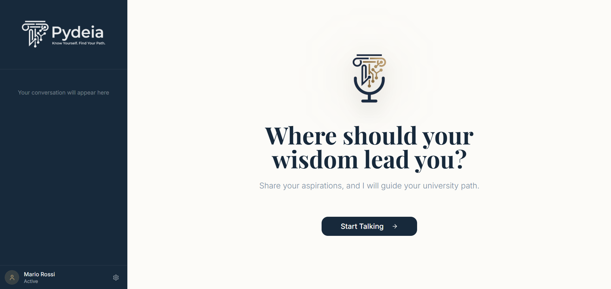
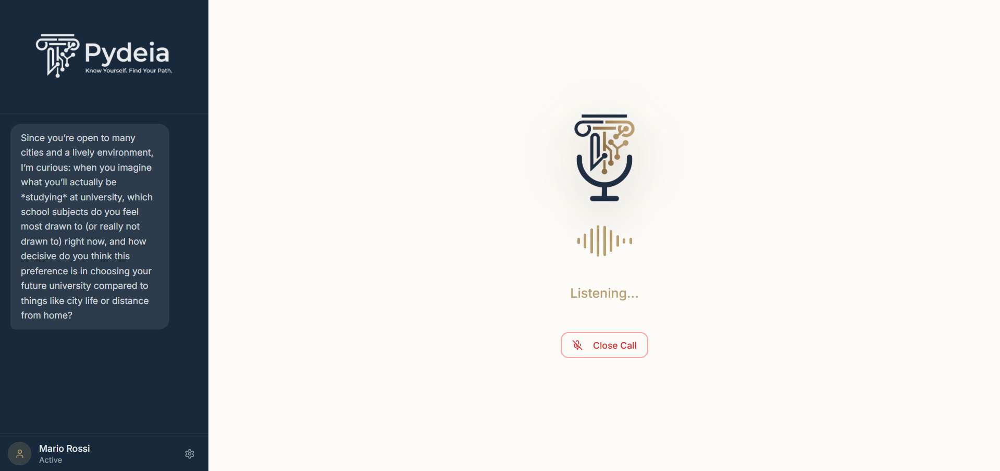
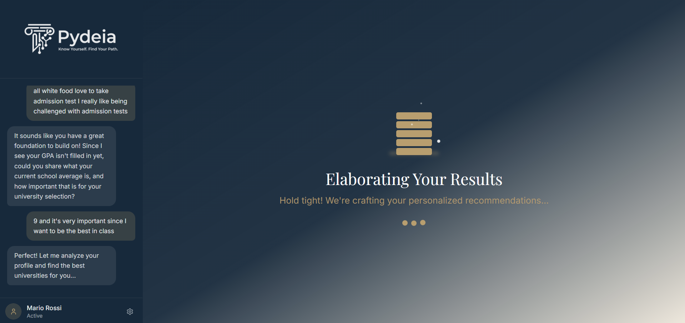
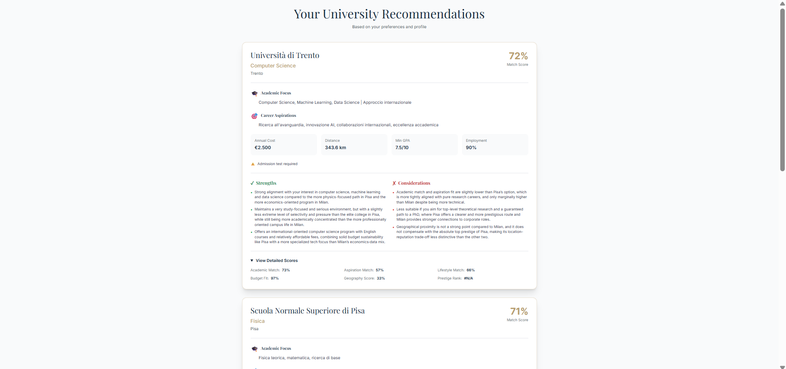

# University Guidance Assistant

A conversational AI assistant that helps high-school students choose university courses in Italy. The system combines a Flask backend (agentic prompts + scoring pipeline) and a React frontend (voice-first UI). The dataset in `data/universities.csv` is synthetic but realistic and used for demonstrations and testing.

> This project was created for the 24-hour hackathon innovAIte 2025.

---

## 🔧 Quick Start (local)

Prerequisites:
- Python 3.8+
- Node.js 16+
- (Optional) Ollama running locally if you want to use local embeddings (the recommender points to `http://localhost:11434`).

Backend (API):
```bash
# from project root
pip install -r server/requirements.txt
python server/server.py
```
The backend starts on: `http://localhost:5002`.

Frontend (website):
```bash
cd website
npm install
npm run dev
```
Open the URL shown by Vite (usually `http://localhost:5173`).

---

## 🧩 What’s included

- `server/` — Flask backend with agent prompts and endpoints
  - `server.py` — main API server: manages conversation flow, prompts, TTS endpoint (ElevenLabs), and the orchestration to produce final recommendations.
  - `recommendation_system.py` — recommender pipeline: creates embeddings (3 coordinate-wise embeddings), computes cosine similarities and a multimodal scoring function that combines semantic and quantitative features.
  - `requirements.txt` — Python dependencies (datapizza, elevenlabs, flask, etc.).

- `website/` — React + Vite frontend
  - `src/pages/Index.tsx` — main voice-driven flow and calls to backend endpoints
  - `src/components/ConversationView.tsx` — voice UI controls
  - `src/pages/Results.tsx` — results and pros/cons view

- `data/universities.csv` — synthetic university dataset used by the recommender.

- `SETUP.md` — short local deployment guide (also in repo root).

---

## 🔍 How it works (high level)

1. Frontend drives a voice-first conversation using the Web Speech API for recognition and ElevenLabs for TTS.
2. The backend extracts structured fields from student messages using a structured LLM prompt (datapizza agents + `EXTRACTION_SYSTEM_PROMPT`).
3. When the profile is complete, a weights agent (WEIGHT_PROMPT) produces normalized weights that are fed to the recommender.
4. `recommend_universities()`:
   - Computes student and university embeddings (three separate semantic coordinates: academic, aspirations, lifestyle).
   - Computes cosine similarities and aggregates semantic scores.
   - Applies a multimodal scoring function (semantic + budget + geography + booleans) and ranks universities.
5. A pro/con agent (PRO_CON_PROMPT) compares top choices to produce user-facing pros and cons.

---

## 🛠 Configuration

- Add API keys in `server/server.py`:
  - `OpenAIClient(api_key="")` — set your OpenAI API key if you use hosted models.
  - `elevenlabs_client = ElevenLabs(api_key="")` — set your ElevenLabs API key for TTS.

- Embeddings:
  - By default the embedding calls are configured to use an Ollama endpoint at `http://localhost:11434/v1` with `api_key='ollama'` (local deployments). If you don't run Ollama, replace the embedding calls to use OpenAI embeddings or another provider.

- ElevenLabs voice / model IDs are hardcoded in `server.py` (voice_id and model_id). Replace them if you want a different voice.

- Dataset: `data/universities.csv` is synthetic and safe to edit. The recommender expects certain column names (e.g. `nome`, `corso`, `annual_cost`, `coordinates`, `min_gpa`, `prestige_rank`, boolean flags like `english_courses`).

---

## 📡 API Endpoints

- `POST /api/get_question` — send an optional `response` body with the student's last answer; returns next AI question and message history.
- `POST /api/generate_results` — trigger final recommendation generation (internal flow; frontend calls it automatically when profile completes).
- `POST /api/text_to_speech` — body `{ text: string }` → returns audio (ElevenLabs)
- `POST /api/reset` — resets the current conversation state.
- `POST /api/initialize` — initializes conversation with example/test input.
- `GET /api/messages` — returns message history.

---

## ✅ Usage notes & troubleshooting

- Browser speech recognition: this project uses the Web Speech API (`SpeechRecognition`). Use Chrome or Edge for best compatibility.
- CORS: backend already enables CORS for `http://localhost:5002`.
- Missing CSV: `recommendation_system` raises a runtime error if `data/universities.csv` is not present — make sure the file exists.
- Ollama: if using Ollama for embeddings, make sure it is running and reachable at `http://localhost:11434/v1` and that the model `granite-embedding:30m` is available.
- If your model responses or pro/con parsing fails, inspect the server logs — the app prints each agent response and will show tracebacks for exceptions.

---

## 🧪 Development & Extensibility

- Add or update universities in `data/universities.csv` (CSV columns must align with the code). You can extend the scoring function in `recommendation_system.py`.
- To alter what the agent asks or how fields are extracted, update the prompts in `server.py` (`EXTRACTION_SYSTEM_PROMPT`, `QUESTION_PROMPT`, etc.).
- To switch to a cloud embeddings provider, adapt `create_student_embedding` and `create_universities_embeddings` in `recommendation_system.py`.

---

## Screenshots
-  — Landing / Home view (hero area showing the app name and CTA)  
  *Shows the initial welcome screen where users can start the voice-guided conversation to get personalized university recommendations.*
-  — Conversation started (initial question + UI before listening)  
  *Displays the first AI-generated question in the conversation flow, with the microphone icon ready for user response via speech recognition.*
-  — Listening state (microphone active, transcript visible)  
  *Illustrates the active listening phase where the app captures the user's spoken answer, showing visual feedback like waveforms and status text.*
-  — Results generation / loading screen  
  *Depicts the animated loading screen that appears after the conversation completes, while the backend processes the student's profile and generates recommendations.*
-  — Results page showing the three recommended universities  
  *Presents the final output: a detailed view of the top three university recommendations, including scores, pros/cons, and key details like cost and distance.*

---

## �📝 License & Credits

This project is a demo / prototype. The university dataset is synthetic for demonstration purposes. Use at your own discretion and test thoroughly before any real-world deployment.

